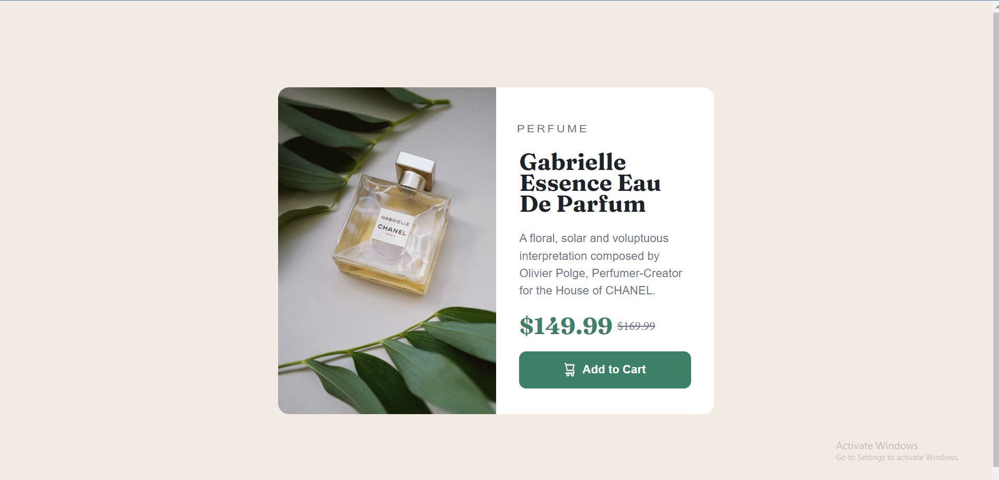

# Frontend Mentor - Product preview card component solution

This is a solution to the [Product preview card component challenge on Frontend Mentor](https://www.frontendmentor.io/challenges/product-preview-card-component-GO7UmttRfa). Frontend Mentor challenges help you improve your coding skills by building realistic projects. 

## Table of contents

- [Overview](#overview)
  - [The challenge](#the-challenge)
  - [Screenshot](#screenshot)
  - [Links](#links)
- [My process](#my-process)
  - [Built with](#built-with)
  - [What I learned](#what-i-learned)
  - [Continued development](#continued-development)
  - [Useful resources](#useful-resources)
- [Author](#author)
- [Acknowledgments](#acknowledgments)

**Note: Delete this note and update the table of contents based on what sections you keep.**

## Overview

### The challenge

Users should be able to:

- View the optimal layout depending on their device's screen size
- See hover and focus states for interactive elements

### Screenshot

#### The Desktop Layout


#### The Mobile Layout


### Links

- Solution URL: [Responsive Card Component using HTML and CSS](https://github.com/mansimar-s/fem_productPreview)
- Live Site URL: [View Live Solution](https://mansimar-s.github.io/fem_productPreview/)

## My process

### Built with

- Semantic HTML5 markup
- CSS custom properties
- Flexbox
- Mobile-first workflow


### What I learned

#### Mobile First Workflow

#### Switching Elements based on Screen Size - Responsive Design


```html
<h1>Some HTML code I'm proud of</h1>
```
```css
.proud-of-this-css {
  color: papayawhip;
}
```

## Author

- Website - [Mansimar Singh](https://direct.me/mansimarsingh)
- Frontend Mentor - [@mansimar-s](https://www.frontendmentor.io/profile/mansimar-s)
- Connect with me on Instagram - [@_mansimarsingh](https://www.instagram.com/_mansimarsingh/)

